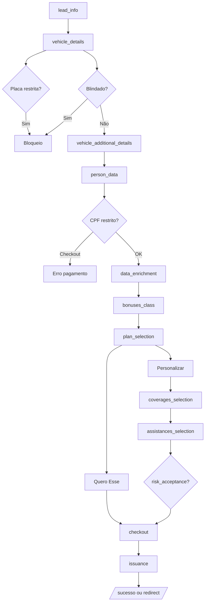

# Mapa de Fluxos — Cotação Seguro Auto

> Inventário de **todas as telas, ações e caminhos** do funil web vs **automação E2E** existente.  
> **Fonte:** `sales-frontend` (sections), Page Objects, specs, `scripts/coverage-inventory.ts`  
> **Última revisão:** 2026-06-24

---

## Diagrama do funil



**Sections GitHub (12 + sucesso):** `lead_info` → `vehicle_details` → `vehicle_additional_details` → `person_data` → `data_enrichment` → `bonuses_class` → `plan_selection` → `coverages_selection` → `assistances_selection` → `risk_acceptance` → `checkout` → `issuance` → `/sucesso`

---

## Resumo de cobertura

| Métrica                       |                                                     Valor |
| ----------------------------- | --------------------------------------------------------: |
| Capacidades testáveis (CAP)   |                                                        44 |
| Cobertura funcional ponderada |                                                   **91%** |
| Cobertura estrita             |                                                       86% |
| Telas com Page Object         |                                               12/13 (92%) |
| Specs E2E                     | 23 arquivos · **73** testes (`tests/spec/e2e/`, chromium) |
| Specs UX (`e2e/ux/`)          |                                        10 · **30** testes |
| Fluxos documentados abaixo    |                                               18 caminhos |
| Gaps testáveis sem spec (⬜)  |                                                         0 |
| Bloqueados por massa (🔒)     |                                                         2 |

---

## Fluxo F1 — Happy path plano pré-formatado (Regular)

**Persona:** usuário mobile/desktop · placa válida · sem bônus · plano Regular · cartão

| #   | Tela                       | Ações principais                                           | POM                          | Spec                                    |
| --- | -------------------------- | ---------------------------------------------------------- | ---------------------------- | --------------------------------------- |
| 1   | lead_info                  | Nome, e-mail, telefone → Continuar                         | LeadInfoPage                 | cotacao-plano-regular                   |
| 2   | vehicle_details            | Placa · zero km off · blindado off → Continuar             | VehicleDetailsPage           | cotacao-plano-regular                   |
| 3   | vehicle_additional_details | CEP, número · garagem · uso Particular → Continuar         | VehicleAdditionalDetailsPage | cotacao-plano-regular                   |
| 4   | person_data                | CPF · estado civil → Continuar                             | PersonDataPage               | cotacao-plano-regular, person-data      |
| 5   | data_enrichment            | Rota automática ou formulário (quando exibido)             | DataEnrichmentPage           | data-enrichment.spec.ts ✅ CAP-17       |
| 6   | bonuses_class              | Não (sem seguro anterior) → Continuar                      | BonusesClassPage             | cotacao-plano-regular, bonuses-class    |
| 7   | plan_selection             | Quero esse **Regular**                                     | PlanSelectionPage            | cotacao-plano-regular, plan-selection   |
| 8   | checkout                   | Checkbox e-mail · accordion · upsells · cartão · Finalizar | CheckoutPage                 | checkout.spec.ts, cotacao-plano-regular |
| 9   | issuance                   | Pagamento confirmado / redirect / webhook                  | IssuancePage                 | cotacao-plano-regular                   |

**Status automação:** ✅ **CAP-01, 03, 07, 11, 18, 37, 40**

---

## Fluxo F2 — Happy path plano personalizado (E2E completo)

**Persona:** personaliza coberturas + assistências · emite apólice

| #   | Tela                            | Ações                                        | Spec                         |
| --- | ------------------------------- | -------------------------------------------- | ---------------------------- |
| 1–5 | _(igual F1 até plan_selection)_ | —                                            | personalizacao               |
| 6   | plan_selection                  | **Personalizar** (`plan-card-button-custom`) | personalizacao, coberturas   |
| 7   | coverages_selection             | Toggles · franquia · indenização → Continuar | personalizacao               |
| 8   | assistances_selection           | Toggles · modais promo/combo → Continuar     | personalizacao, assistencias |
| 9   | checkout → issuance             | Pagamento + 3 caminhos pós-pagamento         | cotacao-plano-personalizado  |

**Status automação:** ✅ **CAP-21, 22–26, 28–30, 36, 37, 40**

---

## Fluxo F3 — Plano Essencial ou Auto 1504 (sem contratar)

| Caminho         | Ações                                        | Spec                     |
| --------------- | -------------------------------------------- | ------------------------ |
| F3a Essencial   | Selecionar card Essencial · asserts keywords | coberturas               |
| F3b Auto 1504   | Card Auto 1504 · guincho 400 km · RPS        | coberturas               |
| F3c Comparativo | Essencial < Regular < Auto 1504 (preço)      | coberturas, precosPlanos |

**Status:** ✅ **CAP-18, 19, 20**

---

## Fluxos negativos

### N1 — Veículo blindado

| Etapa           | Ação            | Resultado esperado    | Spec                            |
| --------------- | --------------- | --------------------- | ------------------------------- |
| vehicle_details | Blindado **on** | Bloqueio · não avança | cotacao-plano-regular ✅ CAP-05 |

### N2 — Placa leilão / restrita

| Etapa           | Ação                    | Resultado esperado | Spec                                      |
| --------------- | ----------------------- | ------------------ | ----------------------------------------- |
| vehicle_details | Placa YOU-0020 (leilão) | Bloqueio           | cotacao-plano-regular **fixme** ⚠️ CAP-06 |

### N3 — CPF blacklist / PEP

| Etapa                  | Ação         | Resultado esperado                          | Spec                            |
| ---------------------- | ------------ | ------------------------------------------- | ------------------------------- |
| person_data → checkout | CPF restrito | Erro no pagamento "Alguma coisa deu errada" | cotacao-plano-regular ✅ CAP-12 |

### N4 — Campos obrigatórios vazios

| Etapa                | Ação                    | Resultado esperado          | Spec                 |
| -------------------- | ----------------------- | --------------------------- | -------------------- |
| lead_info (e outras) | Continuar sem preencher | Erros inline / btn disabled | ✅ **CAP-02** `ux/*` |

---

## Fluxos de preço (variáveis de risco)

Cada linha = **duas cotações** com `resetSession` entre elas (`precosPlanos.spec.ts`).

| ID  | Variável                                   | Comparação        | CAP    | Status              |
| --- | ------------------------------------------ | ----------------- | ------ | ------------------- |
| P1  | Classe bônus 10 vs sem                     | 10 < sem          | CAP-16 | ✅                  |
| P2  | Classe 1 > 5 > 10                          | ordinal           | CAP-16 | ✅                  |
| P3  | Garagem sim vs não                         | com < sem         | CAP-08 | ✅                  |
| P4  | Uso Particular vs App/Comercial/Táxi/Carga | particular menor  | CAP-09 | ✅                  |
| P5  | Casado vs solteiro                         | casado ≤ solteiro | CAP-13 | ✅                  |
| P6  | Zero km vs usado                           | zero > usado      | CAP-04 | 🟡 skip se QA igual |
| P7  | Essencial < Regular < Auto 1504            | hierarquia        | CAP-19 | ✅                  |
| P8  | Idempotência ±2%                           | mesma massa 2×    | CAP-41 | ✅                  |
| P9  | Guard-rails min/max                        | sanidade          | CAP-42 | ✅                  |
| P10 | CEP alto risco                             | preço diferente   | CAP-10 | 🔒 blocked          |
| P11 | Idade motorista                            | preço diferente   | CAP-14 | 🔒 blocked          |

---

## Fluxos de personalização (detalhe)

| ID  | Cenário                                      | Tela        | Spec             | CAP       |
| --- | -------------------------------------------- | ----------- | ---------------- | --------- |
| C1  | Ligar Danos Morais ↑ prêmio                  | coverages   | personalizacao   | CAP-22    |
| C2  | Desligar Roubo e furto ↓ prêmio              | coverages   | personalizacao   | CAP-23    |
| C3  | Incêndio inclusa (sem switch)                | coverages   | personalizacao   | CAP-24    |
| C4  | Franquia ↓ ↑ prêmio                          | coverages   | personalizacao   | CAP-25    |
| C5  | Indenização ↑ ↑ prêmio                       | coverages   | personalizacao   | CAP-26    |
| C6  | Delta simétrico Danos Morais                 | coverages   | validacaoValores | CAP-27 🟡 |
| C7  | Navegar coberturas → assistências → checkout | ambas       | personalizacao   | CAP-36    |
| C8  | Carro reserva ↑ prêmio                       | assistances | personalizacao   | CAP-29    |

---

## Fluxos de assistências

| ID  | Cenário                                      | Spec                           | CAP           |
| --- | -------------------------------------------- | ------------------------------ | ------------- |
| A1  | Catálogo visível (7+ itens)                  | assistencias                   | CAP-28        |
| A2  | IPVA ↑ prêmio                                | assistencias, validacaoValores | CAP-29, 34 🟡 |
| A3  | Bike ↑ prêmio                                | assistencias, validacaoValores | CAP-29        |
| A4  | Histórico veicular ↑                         | assistencias                   | CAP-29        |
| A5  | Leva e traz ↑                                | assistencias                   | CAP-29        |
| A6  | Combo guincho + modal                        | assistencias                   | CAP-30        |
| A7  | Guincho habilita dependentes (RPS, chaveiro) | assistencias                   | CAP-31        |
| A8  | Promo RPS grátis vs cobrado                  | assistenciaRpsPromo            | CAP-32        |
| A9  | Assistências fixas no plano pré-formatado    | plan-preformatted              | CAP-33 ✅     |

---

## Fluxos de bônus

| ID  | Cenário                            | Spec                             | CAP    |
| --- | ---------------------------------- | -------------------------------- | ------ |
| B1  | Não → botão WhatsApp               | validateBonusClass               | CAP-15 |
| B2  | Sim → modal "Não sei minha classe" | validateBonusClass               | CAP-15 |
| B3  | Selecionar classe 1–10             | validateBonusClass, precosPlanos | CAP-16 |
| B4  | "Não quero informar"               | validateBonusClass               | CAP-16 |

---

## Fluxos de checkout (sem pagar / pós-pagamento)

| ID  | Cenário                                                  | Spec                                  | CAP       |
| --- | -------------------------------------------------------- | ------------------------------------- | --------- |
| K1  | Chegar checkout via helper                               | personalizacao                        | CAP-36    |
| K2  | Accordion assistências visível                           | checkout, cotacao-plano-regular       | CAP-39 ✅ |
| K3  | Cross-sell residencial/vida **não** adicionado           | checkout                              | CAP-38 ✅ |
| K4  | Cross-sell interação adicionar                           | checkout                              | CAP-38 ✅ |
| K5  | Pagamento + emissão                                      | cotacao-plano-regular, personalizacao | CAP-37    |
| K6  | 3 caminhos pós-pagamento (sucesso / redirect / issuance) | personalizacao                        | CAP-40    |
| K7  | Finalizar sem cartão — permanece em checkout             | checkout.spec.ts                      | CAP-02 ✅ |

---

## Telas e capacidades — status atual

| Section / tema           | Spec / POM principal             | CAP    | Status |
| ------------------------ | -------------------------------- | ------ | ------ |
| Validação formulário 1–5 | `ux/lead-info` … `bonuses-class` | CAP-02 | ✅     |
| `data_enrichment`        | `data-enrichment.spec.ts`        | CAP-17 | ✅     |
| `risk_acceptance`        | `risk-acceptance.spec.ts`        | CAP-35 | ✅     |
| Plano pré-formatado      | `plan-preformatted.spec.ts`      | CAP-33 | ✅     |
| Cross-sell checkout      | `checkout.spec.ts`               | CAP-38 | ✅     |
| Accordion assistências   | `checkout.spec.ts`               | CAP-39 | ✅     |
| CEP alto risco × preço   | —                                | CAP-10 | 🔒     |
| Idade motorista × preço  | —                                | CAP-14 | 🔒     |
| Placa leilão             | `blockers/` fixme                | CAP-06 | 🟡     |

---

## Matriz section × spec

| Section                    | Page Object                  | Specs que tocam                                                     | CAPs         |
| -------------------------- | ---------------------------- | ------------------------------------------------------------------- | ------------ |
| lead_info                  | LeadInfoPage                 | journeys, `ux/lead-info`                                            | 01 ✅, 02 ✅ |
| vehicle_details            | VehicleDetailsPage           | journeys, `ux/vehicle-details`, precosPlanos                        | 03–06        |
| vehicle_additional_details | VehicleAdditionalDetailsPage | journeys, `ux/vehicle-additional`, precosPlanos                     | 07–10        |
| person_data                | PersonDataPage               | journeys, `ux/person-data`, precosPlanos                            | 11–14        |
| bonuses_class              | BonusesClassPage             | journeys, `ux/bonuses-class`, validateBonusClass, precosPlanos      | 15–16        |
| data_enrichment            | DataEnrichmentPage           | data-enrichment.spec.ts                                             | 17 ✅        |
| plan_selection             | PlanSelectionPage            | cotacao-plano-regular, coberturas, precosPlanos, personalizacao     | 18–21        |
| coverages_selection        | CoveragesSelectionPage       | personalizacao, validacaoValores                                    | 22–27        |
| assistances_selection      | AssistancesSelectionPage     | assistencias, assistenciaRpsPromo, personalizacao, validacaoValores | 28–34        |
| risk_acceptance            | RiskAcceptancePage           | risk-acceptance.spec.ts                                             | 35 ✅        |
| checkout                   | CheckoutPage                 | journeys, `ux/checkout`, personalizacao                             | 36–39        |
| issuance                   | IssuancePage                 | cotacao-plano-regular, personalizacao                               | 40           |
| transversal                | funnel helpers               | precosPlanos, coberturas                                            | 41–44        |

---

## Gaps prioritários (backlog)

| Prioridade | Gap                          | Status   | Ação sugerida                       |
| ---------- | ---------------------------- | -------- | ----------------------------------- |
| **P0**     | CAP-06 placa leilão          | 🟡 fixme | Massa QA ou skip documentado        |
| **P2**     | CAP-04 zero km ordinal       | 🟡       | Assert estrito em `precosPlanos`    |
| **P2**     | CAP-27 / CAP-34 deltas       | 🟡       | Estender `validacaoValores` ou API  |
| **P2**     | CAP-10 / CAP-14 preço        | 🔒       | CEP alto risco + CPF/idade no QA    |
| **P3**     | A11y axe expandido           | ⬜       | `a11y-gap-map.md`                   |
| **P3**     | CI: smoke PR vs nightly full | ⬜       | `@smoke` no pipeline                |
| **P3**     | CAP-02 P3 restante           | ⬜       | Mensagens inline; checkbox checkout |

Itens concluídos recentemente: CAP-02 UX, CAP-17, CAP-33, CAP-35, CAP-38, CAP-39 — ver matriz acima.

---

## Manutenção deste documento

Atualize quando:

1. Nova section no `sales-frontend` → `coverage-config.ts` + esta matriz
2. Novo spec ou cenário → linha no fluxo correspondente + `coverage-inventory.ts`
3. Novo planner → link em [`docs/planners/`](../planners/)

```bash
npm run coverage:sync   # regenera métricas em docs/coverage/
```

---

## Relacionados

- [Boas práticas do repositório](./boas-praticas.md)
- [Cobertura funcional](../coverage/README.md)
- [Planners de cenário](../planners/)
- [Inventário CAP](../../scripts/coverage-inventory.ts)
