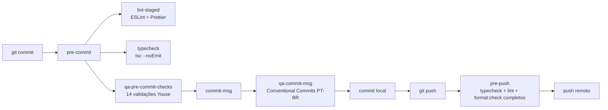

# Pre-Commit Checks · Youse QA E2E

Este projeto usa **Husky** + scripts TypeScript para garantir que cada commit
respeita as boas práticas definidas em `.github/pull_request_template.md` e em
`default.instructions.md`.

## Visão geral



Os checks de `pre-commit` rodam **apenas sobre arquivos staged** para manter o
feedback rápido (< 5s na maioria dos commits). O `pre-push` faz a validação
completa antes de enviar para o remote.

## O que é validado no `pre-push`

Validação completa antes de enviar commits para o repositório remoto. Roda
apenas quando há commits novos no branch (`@{u}..HEAD`):

| #   | Check                                              | Origem              |
| --- | -------------------------------------------------- | ------------------- |
| 1   | `tsc --noEmit` em todo o projeto                   | `tsconfig.json`     |
| 2   | `eslint .` em todos os arquivos (`max-warnings=0`) | `eslint.config.mjs` |
| 3   | `prettier --check` em `**/*.{ts,json,yml,md}`      | `.prettierrc`       |

Equivalente ao job `validate` do CI — qualquer erro aqui já indicaria PR
vermelho no GitHub Actions.

## Regras ESLint adicionais (Clean Code / SOLID)

Além das regras do plugin Playwright, ativamos:

| Regra                  | Nível | Por quê                                                       |
| ---------------------- | ----- | ------------------------------------------------------------- |
| `eqeqeq`               | error | Comparação estrita — sem coerção implícita                    |
| `no-var`               | error | `var` é legado — use `let`/`const`                            |
| `prefer-const`         | error | Variáveis nunca reatribuídas devem ser `const`                |
| `no-with`              | error | Operador `with` é fonte de bugs sutis                         |
| `no-eval`              | error | Veta `eval` e `setTimeout("string")`                          |
| `no-implied-eval`      | error | Idem para chamadas implícitas                                 |
| `no-self-compare`      | error | `x === x` é sempre bug                                        |
| `no-cond-assign`       | error | Atribuições em `if/while` precisam de parênteses explícitos   |
| `no-else-return`       | warn  | `else` após `return` é ruído                                  |
| `no-duplicate-imports` | error | Consolide imports do mesmo módulo                             |
| `no-console`           | warn  | Apenas em código de produção — specs e scripts são permitidos |

## O que é validado no `pre-commit`

| #   | Check                                                                                                         | Nível | Origem do requisito       |
| --- | ------------------------------------------------------------------------------------------------------------- | ----- | ------------------------- |
| 1   | ESLint sem warnings (`max-warnings=0`) nos `.ts` staged                                                       | error | `eslint.config.mjs`       |
| 2   | Prettier aplicado em `.ts/.json/.yml/.md` staged                                                              | error | `.prettierrc`             |
| 3   | `tsc --noEmit` em todo o projeto                                                                              | error | `tsconfig.json` strict    |
| 4   | Bloqueia `.env`, `.env.*` (exceto `.env.example`)                                                             | error | LGPD / segurança          |
| 5   | Bloqueia artefatos na raiz (`.log`, `.png`, `.mp4`, `.webm`, `.zip`, `.har`, `.trace`)                        | error | `.gitignore`              |
| 6   | Detecta `api_key/secret/token/password` em texto claro                                                        | error | OWASP A07                 |
| 7   | Detecta CPFs reais hardcoded                                                                                  | warn  | LGPD                      |
| 8   | Detecta e-mails pessoais (gmail/hotmail/yahoo/...)                                                            | warn  | LGPD                      |
| 9   | Sem `page.waitForTimeout` em `tests/**`                                                                       | error | Playwright best practice  |
| 10  | Sem `test.only` / `describe.only` / `fdescribe`                                                               | error | Evita esquecer foco no CI |
| 11  | Evita `{ force: true }` em ações Playwright                                                                   | warn  | Bypass de visibility      |
| 12  | Prefira `toBeVisible()` ao invés de `isVisible()`                                                             | warn  | Web-first assertions      |
| 13  | Sem `debugger;`                                                                                               | error | Debug residual            |
| 14  | `console.log` em tests/scripts                                                                                | warn  | Use Allure attachments    |
| 15  | Novos `.spec.ts` precisam de tag (`@smoke/@ux/@journey/@regression/@a11y/@pricing/@quotation_auto/@keyboard`) | error | Estratégia de tags        |
| 16  | Arquivo > 500 KB                                                                                              | warn  | Evita binários no git     |
| 17  | `TODO/FIXME` sem ticket Jira (ex: `TODO POSV-123`)                                                            | warn  | Rastreabilidade           |

> **Bloqueio:** itens `error` interrompem o commit. `warn` apenas alertam.

## O que é validado no `commit-msg`

1. **Padrão Conventional Commits**: `type(scope?): descrição em pt-br`.
   Tipos aceitos: `feat, fix, refactor, chore, docs, test, perf, ci, build, style, revert`.
2. **Título ≤ 72 caracteres**, no imperativo, em PT-BR.
3. **Segunda linha em branco** se houver corpo.
4. **Heurística anti-mistura de idiomas** (warn): alerta se detectar 2+
   palavras inglesas no título.

### Exemplos válidos

```
feat(quotation): adiciona validação de CPF no endpoint de criação de cliente
fix(checkout): corrige loop de redirecionamento no pagamento PIX
refactor(pages): extrai helpers de a11y para tests/helpers/a11y.ts
chore(ci): aumenta timeout do job de smoke para 30 min
docs(coverage): atualiza % CAP após inclusão da spec PAY-P4
test(pricing): adiciona cenário de bônus invertido para idade < 25
```

### Exemplo inválido

```
add new test for pix payment          ❌ inglês + sem tipo
feat: adiciona suporte ao novo fluxo de pagamento via PIX no checkout B2C  ❌ > 72 chars
fix corrige bug de validacao          ❌ falta `:`
```

## Como rodar manualmente

```bash
# Roda apenas a bateria QA (sobre staged)
npm run qa:precommit

# Roda typecheck + lint + format + checks QA
npm run qa:check

# Valida uma mensagem de commit já escrita
npm run qa:commitmsg -- caminho/para/COMMIT_EDITMSG
```

## Pulando os hooks

Apenas em emergência e **com justificativa explícita no PR**:

```bash
git commit --no-verify -m "hotfix: ..."
```

## Como adicionar um novo check

1. Edite `scripts/qa-pre-commit-checks.ts`.
2. Adicione um objeto na lista `CHECKS`:

   ```ts
   {
     name: 'Descrição curta',
     level: 'error' | 'warn',
     run: ({ stagedFiles, newFiles }) => string[],
   }
   ```

3. Atualize a tabela neste documento.
4. Abra PR com o tipo `chore(ci)` ou `chore(qa)`.

## Troubleshooting

- **`ts-node: command not found`** → rode `npm install` para restaurar
  `node_modules`. Os hooks usam `npx --no-install` propositalmente para
  falhar cedo quando dependências estão faltando.
- **Hook não dispara** → confirme `core.hooksPath`:
  `git config core.hooksPath` deve retornar `.husky/_`.
  Caso contrário, rode `npm run prepare`.
- **Falsos positivos em LGPD** → mova dados de teste para
  `tests/data/` ou `tests/fixtures/` (essas pastas ficam fora do scan de
  CPF, conforme regex do check).
